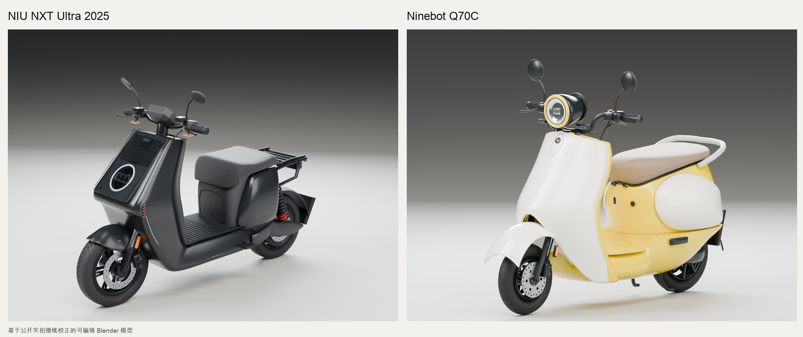

# NIU NXT Ultra 2025 / Ninebot Q70C

黑色短座版小牛 NXT Ultra 2025 与柠檬黄九号 Q70C 的可编辑 Blender 模型。依据公开实拍继续校正，包含生成源码、GLB、高清展示图及几何校核记录。



## 下载

[完整成果包 v0.1.0](https://github.com/jaden20030518-lgtm/scooter-models-nxt2025-q70c/releases/download/v0.1.0/scooter-models-v0.1.0.zip) · [Release 页面](https://github.com/jaden20030518-lgtm/scooter-models-nxt2025-q70c/releases/tag/v0.1.0)

- **NXT**：[Blender 模型](NIU_NXT_Ultra_2025/NIU_NXT_2025_Refined.blend) · [GLB](NIU_NXT_Ultra_2025/NIU_NXT_2025_Refined.glb) · [4K 主图](NIU_NXT_Ultra_2025/展示图/niu_hero.png)
- **Q70C**：[Blender 模型](Ninebot_Q70C/Ninebot_Q70C_Refined.blend) · [GLB](Ninebot_Q70C/Ninebot_Q70C_Refined.glb) · [4K 主图](Ninebot_Q70C/展示图/q70_hero.png)
- [NXT 前后对比](niu_前后对比.jpg) · [Q70C 前后对比](q70_前后对比.jpg)

模型、源码和展示图可直接在仓库下载；完整 ZIP 放在 Release 中。

## 内容

- `NIU_NXT_Ultra_2025/`：三光学区与分层灯罩、短座与货架、座桶、驾驶舱、镜杆及制动细节。
- `Ninebot_Q70C/`：圆润侧盖、浅灰扶手、尾灯、驾驶区与可打开坐垫。Blender 时间轴第 **1 帧闭合，第 45 帧打开**。
- 两个 `*_Product_Studio.blend`：统一棚拍场景，主相机为 4096×3072。
- `展示图/`：4096×3072 主图，以及 2400×1800 的侧面、后侧与细节图。
- `tools/`：统一渲染和独立几何校核脚本。

## 使用

使用 Blender 5.2.1 LTS 打开 `.blend`。GLB 是闭合状态的静态导出；程序化材质的完整表现以 Blender 工程为准。

从仓库根目录重新生成：

```sh
blender -b --python-exit-code 1 --python NIU_NXT_Ultra_2025/build_niu_refined.py
blender -b --python-exit-code 1 --python Ninebot_Q70C/build_q70_refined.py
```

如果 macOS 未配置 `blender` 命令，将其替换为 `"/Applications/Blender.app/Contents/MacOS/Blender"`。模型生成器按自身文件目录保存结果。

统一渲染示例：

```sh
blender -b --python-exit-code 1 --python tools/render_views.py -- \
  --asset Ninebot_Q70C/Ninebot_Q70C_Refined.blend --kind q70 \
  --out renders/q70 --views hero --resolution 2400 --samples 64
```

旧版对比 PNG 已包含在仓库中。NIU 的可选 `render_previews.py -- --baseline` 需要历史 `Production_NIU` 目录，本仓库不包含该历史工程；当前模型的生成与渲染不依赖它。

## 验证与参考

已检查轴距、座面、对象层级、有限坐标，并重新导入 GLB 比对几何边界。Q70C 检查了坐垫闭合/打开状态。各车的 `independent_validation.json` 记录对应结果。

[使用与变化说明](README_使用与变化.md) · [NXT 制作与来源](NIU_NXT_Ultra_2025/README_实拍细化版.md) · [Q70C 制作与来源](Ninebot_Q70C/README_实拍重建与打开坐垫.md)

这是非官方的视觉重建。未测量的车壳截面、壳厚和部分连接尺寸仍有估算，尚不属于已经核实到原厂数据的完美复刻。
